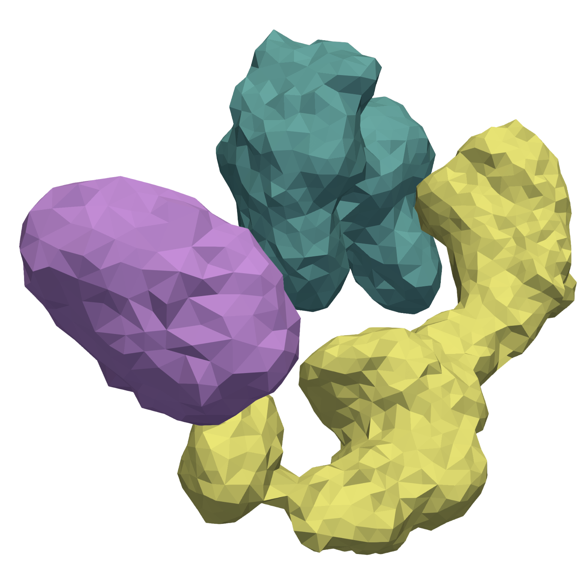

<p align='center'>
  
</p>

<h1 align='center'>BioSET</h1>

<p align='center'>
  Interactive 3D visualization and spatial analysis for multiplexed tissue imaging data.
</p>

## Repositories

| Repository | Description |
|---|---|
| [BioSET Visualizer](https://github.com/nyu-vis-krueger-group/BioSET_Visualizer.git) | Trame/VTK-based interactive 3D viewer with volume rendering, surface overlays, and co-localization heatmaps |
| [BioSET Preprocessing](https://github.com/nyu-vis-krueger-group/BioSET_Preprocessing.git) | GPU-accelerated pipeline for thresholding, segmentation, multi-radius dilation, and overlap mining |
| [Isosurface-Based Segmentation](https://github.com/nyu-vis-krueger-group/Isosurface_Based_Segmentation.git) | Optional surface mesh extraction for 3D label rendering |

## Preprocessed Data

Preprocessed outputs for the [melanoma in-situ dataset](https://www.nature.com/articles/s41592-025-02824-x):

| Resource | Link |
|---|---|
| Data Zarr | [S3 Store](https://lsp-public-data.s3.amazonaws.com/biomedvis-challenge-2025/Dataset1-LSP13626-melanoma-in-situ/0) |
| Co-localization database (`.bioset`) | [Google Drive](https://drive.google.com/file/d/1M4YQ218duZPm3Ga_yuKmu7eDDm5269tb/view?usp=drive_link) |
| Extracted meshes | [Google Drive](https://drive.google.com/file/d/1cLf7QgNUdTYi_QxCaCFH1K03scw-eJJZ/view?usp=drive_link) |

## Quick Start

### 1. Visualizer

```bash
git clone --recurse-submodules https://github.com/nyu-vis-krueger-group/BioSET_Visualizer.git
cd BioSET_Visualizer
python -m venv .venv
source .venv/bin/activate
pip install -U pip
pip install -e .
```

Configure the zarr path, channel indices, and voxel spacing in `app.py`, then run:

```bash
bioset
```

This starts a local server and opens the viewer at [http://localhost:8080/index.html](http://localhost:8080/index.html). See the [visualizer README](https://github.com/nyu-vis-krueger-group/BioSET_Visualizer#readme) for remote server setup and additional options.

### 2. Preprocessing

```bash
git clone https://github.com/nyu-vis-krueger-group/BioSET_Preprocessing.git
cd BioSET_Preprocessing
conda create -n bioset python=3.11
conda activate bioset
pip install -e .
```

See the [preprocessing README](https://github.com/nyu-vis-krueger-group/BioSET_Preprocessing#quick-start) for pipeline configuration and usage. Alternatively, download the preprocessed `.bioset` database and meshes from the links above.

#### Surface Extraction (optional)

For 3D surface mesh extraction:

```bash
git clone https://github.com/nyu-vis-krueger-group/Isosurface_Based_Segmentation.git
```

See the [repository README](https://github.com/nyu-vis-krueger-group/Isosurface_Based_Segmentation#readme) for setup and usage.

## License

MIT License
