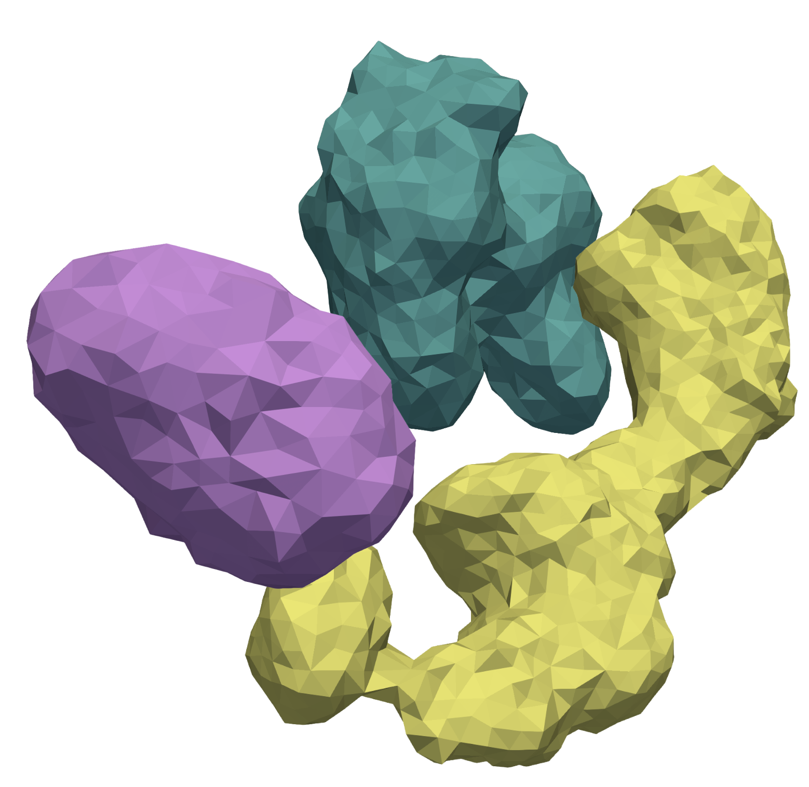

<p align='center'>
  
</p>

<h1 align='center'>BioSET</h1>

<p align='center'>
  Interactive 3D visualization and spatial analysis for multiplexed tissue imaging data.
</p>

## Repositories

| Repository | Description |
|---|---|
| [BioSET Visualizer](https://github.com/nyu-vis-krueger-group/BioSET_Visualizer) | Interactive 3D viewer with volume rendering, surface rendering, and co-localization plots and spatial guidance mechanisms. |
| [BioSET Preprocessing](https://github.com/nyu-vis-krueger-group/BioSET_Preprocessing.git) | GPU-accelerated pipeline for denoising, dilating and finding biomarker co-localizations, as well as for extracting surfaces. |

## Preprocessed Data

Please contact the authors for access to preprocessed data. 

## Quick Start

### 1. Visualizer

```bash
git clone --recurse-submodules https://github.com/nyu-vis-krueger-group/BioSET_Visualizer.git
cd BioSET_Visualizer
python -m venv .venv
source .venv/bin/activate
pip install -U pip
pip install -e .
```

Configure the zarr path, channel indices, and voxel spacing in `app.py`, then run:

```bash
bioset
```

This starts a local server and opens the viewer at [http://localhost:8080/index.html](http://localhost:8080/index.html). See the [visualizer README](https://github.com/nyu-vis-krueger-group/BioSET_Visualizer#readme) for remote server setup and additional options.

### 2. Preprocessing

```bash
git clone https://github.com/nyu-vis-krueger-group/BioSET_Preprocessing.git
cd BioSET_Preprocessing
conda create -n bioset python=3.11
conda activate bioset
pip install -e .
```

See the [preprocessing README](https://github.com/nyu-vis-krueger-group/BioSET_Preprocessing#quick-start) for pipeline configuration and usage. Alternatively, download the preprocessed `.bioset` database and meshes from the links above.

## License

[MIT License](https://github.com/nyu-vis-krueger-group/BioSET/blob/main/LICENSE)
